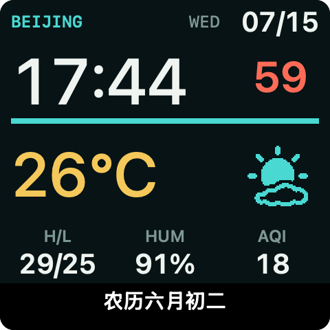
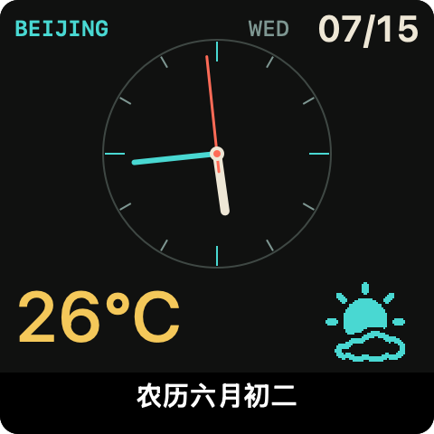
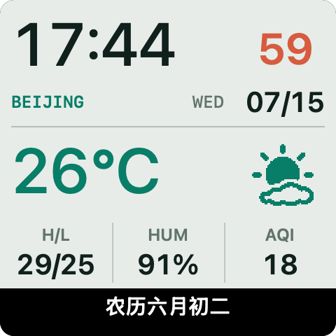
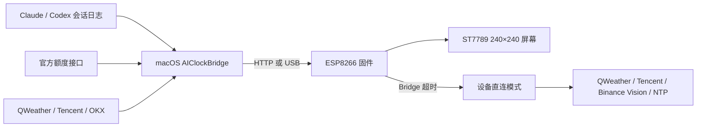

<p align="center">
  
</p>

<h1 align="center">ESP8266 AI Screen</h1>

<p align="center">
  一块会显示 AI 编程状态、天气、行情和网速的 240×240 桌面信息屏
</p>

<p align="center">
  
  
  
  
  
</p>

ESP8266 AI Screen 把设备固件、macOS 菜单栏 Bridge 和设备 Web 控制台放在同一套项目里。屏幕可以显示 Claude Code 与 Codex CLI 的工作状态和额度、实时天气、QQQ 与数字货币行情，以及本机网速。Bridge 暂时退出后，天气、行情和 NTP 会切到设备直连，时钟不会因为电脑端应用关闭而停住。

当前版本为 `0.5.10`。这是针对特定 ESP8266EX 桌面屏板型维护的硬件项目，不是适用于所有 ESP8266 开发板的通用固件。编译或刷写前，请先核对屏幕驱动、引脚、Flash 容量和分区布局。

## 三套天气主题

<table>
  <tr>
    <td align="center" width="33.33%">
      <br>
      <strong>晨光数字</strong><br>
      <sub>大号时间、数字秒与分钟进度</sub>
    </td>
    <td align="center" width="33.33%">
      <br>
      <strong>港湾表盘</strong><br>
      <sub>模拟时针、分针与红色秒针</sub>
    </td>
    <td align="center" width="33.33%">
      <br>
      <strong>气象仪表</strong><br>
      <sub>天气数据与表盘组合布局</sub>
    </td>
  </tr>
</table>

三套主题共用实时天气图标、温度与空气质量数据，并保留逐秒动画。天气位置使用项目配置中的示例值，请在本地改成自己的城市级位置，不要把精确住址或个人 API Key 提交到 Git。

## 功能

| 页面或能力 | 当前实现 |
|---|---|
| Claude / Codex | 读取本机会话日志判断工作状态，显示官方额度窗口、重置时间和审批提醒 |
| 桌宠 | Claude 与 Codex 独立动画，支持从 Petdex 选择或上传 GIF，上传失败时保留当前动画 |
| 天气时钟 | 和风天气实况、三日温度范围、湿度、AQI、农历、NTP 和 17 类天气图标 |
| 行情 | 默认显示 `QQQ`、`BTCUSDT`、`ETHUSDT`、`ETHBTC`，最多配置 4 项，绿涨、红跌、灰平 |
| 网速 | macOS 端 4 Hz 采样，设备显示约 56 秒的下载与上传趋势 |
| Web 控制台 | 切换页面、调整亮度、配置行情与天气、选择时钟主题、控制农历和 NTP |
| 屏幕计划 | 夜间亮度、定时熄屏、跨午夜时段、临时点亮与手动熄屏 |
| 断线恢复 | Bridge 与设备直连自动切换，公开数据源失败时保留最后一份有效数据 |
| 菜单栏 Bridge | 屏幕镜像、显示模式切换、设备发现与配对、桌宠选择和状态服务 |

Web 控制台位于 `http://<DEVICE_IP>/`。控制台使用未鉴权的局域网 HTTP，只适合可信内网或 USB 环境，不能通过端口映射直接暴露到公网。

## 在线与离线链路



| 数据 | Bridge 在线 | Bridge 离线 |
|---|---|---|
| Claude / Codex 状态与额度 | 从本机日志和已登录 CLI 的凭据读取 | 保留最后状态，不继续更新 |
| QQQ | 腾讯行情经 Bridge 转换 | 设备直连腾讯行情 |
| 数字货币 | OKX 公开现货行情 | 设备直连 Binance Vision |
| 天气 | Bridge 请求和风天气并下发农历位图 | 已配置设备端凭据时，设备直连和风天气 |
| 时间 | 设备自行 NTP 对时 | 设备自行 NTP 对时 |
| 网速 | Bridge 采样本机物理网卡 | 停止更新 |

Bridge 连续不可用约 15 秒后，设备开始尝试直连。Bridge 恢复时会自动接回本机数据。天气和行情响应只有在完整校验通过后才会替换 last-good 缓存，单次请求失败不会清空屏幕。

## 支持的硬件

当前 PlatformIO 环境面向以下组合：

| 部件 | 目标配置 |
|---|---|
| 主控 | ESP8266EX / ESP-12S |
| Flash | 4 MB |
| 屏幕 | 1.54 英寸 ST7789，240×240，SPI |
| USB 转串口 | CH340C 或可枚举为串口的兼容芯片 |
| 屏幕驱动 | TFT_eSPI `ST7789_2_DRIVER` |
| 背光 | GPIO5，低电平点亮，支持 PWM 亮度 |

目标板的引脚定义在 [`firmware/platformio.ini`](firmware/platformio.ini)。外观相似的成品屏也可能采用不同接线或 Flash 布局，不能只凭商品名称判断兼容性。完整引脚、HTTP API 和运行状态机见 [`docs/DEVELOPMENT.md`](docs/DEVELOPMENT.md)。

## 快速开始

### 构建固件

需要 Python 3 和 PlatformIO：

```bash
git clone <REPOSITORY_URL>
cd esp8266-ai-screen/firmware
python3 -m venv .pio-venv
source .pio-venv/bin/activate
pip install platformio
pio run
```

构建产物位于 `firmware/.pio/build/nodemcuv2/firmware.bin`。`pio run` 只编译，不会写入设备。

### 启动 macOS Bridge

需要 macOS 12 或更高版本，以及 Swift 5.9 工具链：

```bash
cd mac-app
./package-app.sh release
open .build/AIClockBridge.app
```

本地状态接口可以这样检查：

```bash
curl -fsS http://localhost:8765/status | python3 -m json.tool
```

设备首次启动时会创建 `AI-Clock-Setup` 配网热点。完成 Wi-Fi 配置后，在设备控制台填写 Bridge 地址 `<BRIDGE_HOST>:8765`。设备地址使用路由器当前分配的值，不要把某次 DHCP 地址写死到源码或文档。

### 配置天气

和风天气需要项目专属 API Host 和 API Key：

- macOS Bridge 从系统钥匙串服务 `AIClockBridge QWeather` 读取账号 `api-host` 与 `api-key`。
- 设备直连凭据从 `http://<DEVICE_IP>/` 的天气设置保存到 LittleFS。
- API Host 使用 `<QWEATHER_API_HOST>`，API Key 使用 `<QWEATHER_API_KEY>`，仓库里只保留占位符。
- 天气位置改成自己的城市级经纬度即可，不建议保存精确住址坐标。

设备管理页不会回显 API Key，但 Key 会存入 LittleFS。包含设备设置的 LittleFS 备份也属于敏感文件，不应提交或公开分享。

## 安全刷写

刷写会直接改变设备 Flash。只有硬件、分区和镜像都确认匹配时，才执行写入命令。

```bash
PORT="<SERIAL_PORT>"
IMAGE="firmware/.pio/build/nodemcuv2/firmware.bin"

python3 -m esptool --port "$PORT" chip_id
python3 -m esptool --port "$PORT" flash_id
shasum -a 256 "$IMAGE"
```

核对结果后，本项目目标板的应用固件从 `0x000000` 写入：

```bash
python3 -m esptool --port "$PORT" --baud 460800 \
  write_flash 0x000000 "$IMAGE"
```

刷写边界：

- 不执行 `erase_flash`。
- 不把应用固件写入 `0x300000` 起的 LittleFS 区域。
- 不在串口身份、Flash 容量、镜像哈希或目标板型不一致时继续。
- 不直接套用其他 ESP8266 教程里的引脚、地址或分区参数。
- 先备份原厂 Flash 和设备设置，再做第一次写入。
- 当前固件接近应用分区容量上限，增加字体、图片或网络库后要重新检查 PlatformIO 的空间报告。

`<SERIAL_PORT>` 必须替换为本次插拔后实际枚举的串口。不要把自己的串口路径、设备 MAC、固件备份或哈希记录提交到公开仓库。

完整的备份、尺寸门禁和启动检查见 [`docs/FLASHING.md`](docs/FLASHING.md)。

## 项目结构

```text
firmware/      ESP8266 固件、屏幕渲染和设备 Web 控制台
mac-app/       macOS 菜单栏 Bridge、镜像窗口和本机数据采集
windows-app/   Windows 托盘实验版
docs/          开发说明、第三方资源与界面预览
tools/         天气图标和桌宠资源生成工具
```

固件使用 PlatformIO 与 Arduino framework。macOS Bridge 是 Swift Package，只依赖系统框架。天气图标会生成 ESP8266 和 Swift 共用的单色位图数据，确保设备与菜单栏镜像使用同一套图形。

## Windows 版限制

`windows-app/` 保留了基于 .NET 8 WinForms 的托盘移植版，支持基础状态服务、屏幕镜像和设备控制。当前 `0.5.10` 的完整验证路径是 ESP8266 固件与 macOS Bridge，Windows 版尚未完成同等范围的真机回归，以下能力不能视为与 macOS 完全一致：

- 设备独立联网切换与天气、行情配置同步。
- 基于 `device_id` 的发现、配对和地址变化恢复。
- 最新 Web API 的全部安全参数与错误处理。
- 固件刷写入口。

Windows 版适合继续开发和协议联调，日常使用前请先阅读 [`windows-app/README.md`](windows-app/README.md) 并自行验证当前设备。

## 安全与隐私

- 仓库不需要保存 Wi-Fi 密码、API Key、OAuth Token、Cookie 或设备备份。
- Bridge 只复用本机 Claude Code 与 Codex CLI 已有的登录状态，额度凭据只发送到各自官方接口。
- Bridge 的局域网 HTTP 状态接口不含 API Key，但仍可能暴露工作状态和用量，不应开放到公网。
- 公开问题或日志前，请清除设备地址、MAC、串口名、用户名和本机绝对路径。
- 自定义 GIF、LittleFS 镜像与配置导出可能带有个人内容，默认不纳入版本控制。

## 上游与第三方资源

> Derived from [`pengchujin/esp8266-ai`](https://github.com/pengchujin/esp8266-ai) at [`4476bf8`](https://github.com/pengchujin/esp8266-ai/commit/4476bf8).

本项目在上游基础上增加了新的设备页面、Bridge 直连切换、天气与行情链路、控制台和桌面端功能。上游仓库当前没有提供仓库级 `LICENSE` 文件，因此本仓库不会为继承代码新增许可声明，也不声称它采用 MIT 许可或允许商用。使用、修改或再分发前，请先向原作者确认授权范围。

天气界面使用 QWeather Icons v1.8.0 的部分图标。图标来源、使用范围、位图化修改和 CC BY 4.0 署名见 [`docs/THIRD_PARTY_NOTICES.md`](docs/THIRD_PARTY_NOTICES.md)。其他第三方依赖分别遵循其上游许可。
